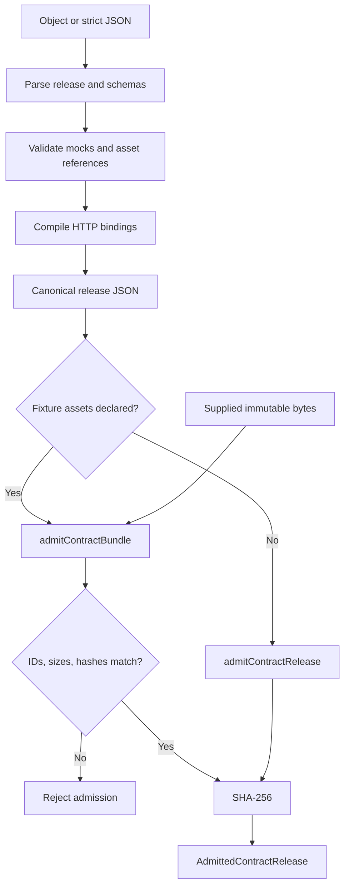
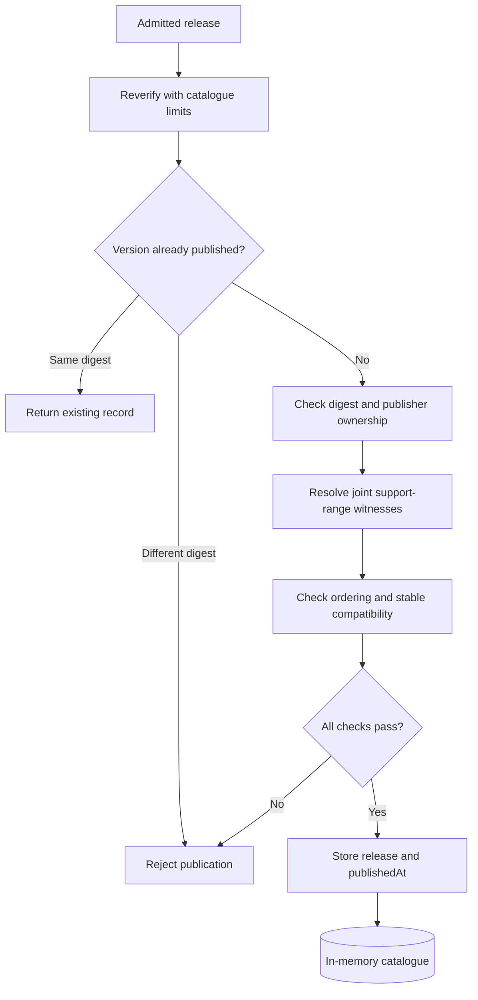
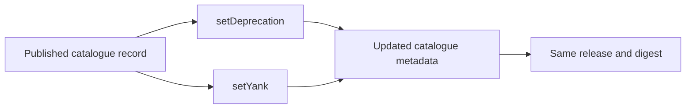

# 1. Contract admission and publication

[All flows](./README.md) · Next: [Compatibility](./02-compatibility.md)

## Admission — implemented

Parsing validates the document. Admission also compiles its bindings and
returns its canonical identity. It does not resolve external requirements or
publish anything in a catalogue.

Every validation stage can reject. Calling `admitContractRelease` with declared
assets rejects: use the bundle path instead. The `Json` variants additionally
enforce strict JSON syntax, duplicate-key rejection and input byte/depth limits.

Binary mock leaves use `{ assetId }`. Asset metadata is part of the release
JSON; the bytes are supplied separately and verified against that metadata.
The result contains the frozen release, compiled bindings, canonical JSON,
digest and, for bundles, verified assets. Mocks remain examples, not handlers.

## Catalogue publication — implemented

Ownership, requirements and admission checks also reject immediately on
failure. The catalogue is currently in memory, not a remote registry. Each
support range must have a published witness jointly satisfying that capability's
requirements to the same contract. Omitted `supportRanges` means the whole
accepted range, not its OR branches. Historical yanked releases remain valid
references. This does not prove that the complete site graph is installable. See
[requirements](./03-requirements.md) and [compatibility](./02-compatibility.md).

## Metadata after publication — implemented

Deprecation and yank are independent metadata. Either can be cleared with
`null`. A new release does not automatically deprecate an old one, and
`sunsetAt` is informational, not an automatic cutoff. Yank is not deletion.

Sources: [prepareContractRelease](../packages/features/cms-repository/src/contracts/core/admission/prepareContractRelease.ts),
[admitContractRelease](../packages/features/cms-repository/src/contracts/core/admission/admitContractRelease.ts),
[admitContractBundle](../packages/features/cms-repository/src/contracts/core/admission/admitContractBundle.ts),
[verifyFixtureAssets](../packages/features/cms-repository/src/contracts/core/admission/verifyFixtureAssets.ts),
[InMemoryReleaseCatalogue](../packages/features/cms-repository/src/contracts/default-implementation/memory/InMemoryReleaseCatalogue.ts).
