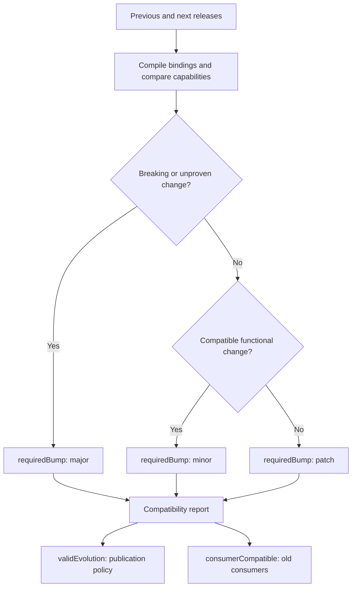
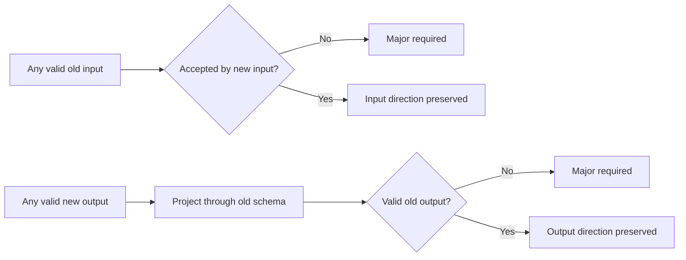

<# 2. Compatibility and versioning

[All flows](./README.md) · Next: [Requirements](./03-requirements.md)

## Compare two releases — implemented

The highest required bump wins. New capabilities, wider accepted inputs,
provably safe output changes, wider dependency ranges and changed compiled
bindings require at least a minor. Removal of capabilities, changed access,
behavior or error definitions, and lost dependency alternatives require a major.
Documentation, mocks and semantically equivalent schemas/ranges can stay patch.

The flags answer different questions:

| Example | validEvolution | consumerCompatible |
| --- | --- | --- |
| Documentation-only patch | true | true |
| Safe addition incorrectly numbered as patch | false | true |
| Breaking change correctly numbered as major | true | false |
| Breaking change incorrectly numbered as minor | false | false |

Identity and publisher must also match. Neither flag proves that a provider
serves an older HTTP binding or passed conformance.

## Direction of schema compatibility — implemented

Projection can drop newly added object fields recursively, including inside
arrays and maps. It cannot truncate strings or containers or coerce types.
Old required fields and property-count bounds must still hold. Removing an old
output field is conservatively major, even if it was optional.

For example, accepting input strings up to 150 instead of 100 characters can be
minor. Producing output strings up to 150 instead of 100 is major: the old
consumer still has a 100-character bound. A site's selected limits never widen
merely because a provider build changes.

## Previews and maintenance — implemented catalogue policy

The following branches are separate publication examples after `1.0.0`:

```mermaid
flowchart LR
    stable["Stable 1.0.0"] --> preview["Publish 1.1.0-alpha.1"]
    preview --> patch["Publish unchanged 1.0.1"]
    stable --> first["Publish 2.0.0-alpha.1"]
    first --> revised["Change shape in 2.0.0-alpha.2"]
    revised --> finalRelease["Publish 2.0.0"]
    stable --> incompatible["Breaking 1.1.0-alpha.1"]
    incompatible --> rejected["Reject: stable major broken"]
```

Same-target previews must increase in SemVer order, but their shape may evolve.
Publication independently compares against the latest stable release of that
major. Future previews do not block stable patches. Different majors can be
maintained independently; stable minor lines within a major are not separate
maintenance branches. `0.x` follows the same conservative policy.

Sources: [compareContractReleases](../packages/features/cms-repository/src/contracts/core/compatibility/compareContractReleases.ts),
[compareCapability](../packages/features/cms-repository/src/contracts/core/compatibility/compareCapability.ts),
[projectedOutput](../packages/features/cms-repository/src/contracts/core/compatibility/schema/projectedOutput.ts),
[verifyEvolution](../packages/features/cms-repository/src/contracts/core/catalogue/verifyEvolution.ts).
