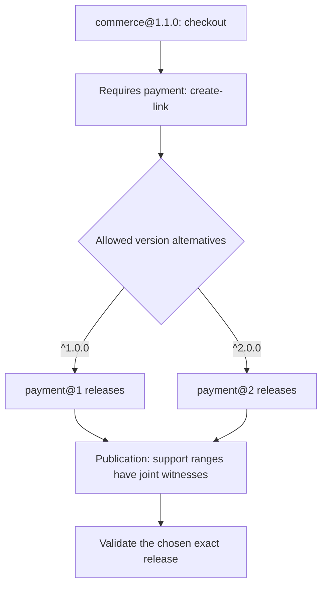
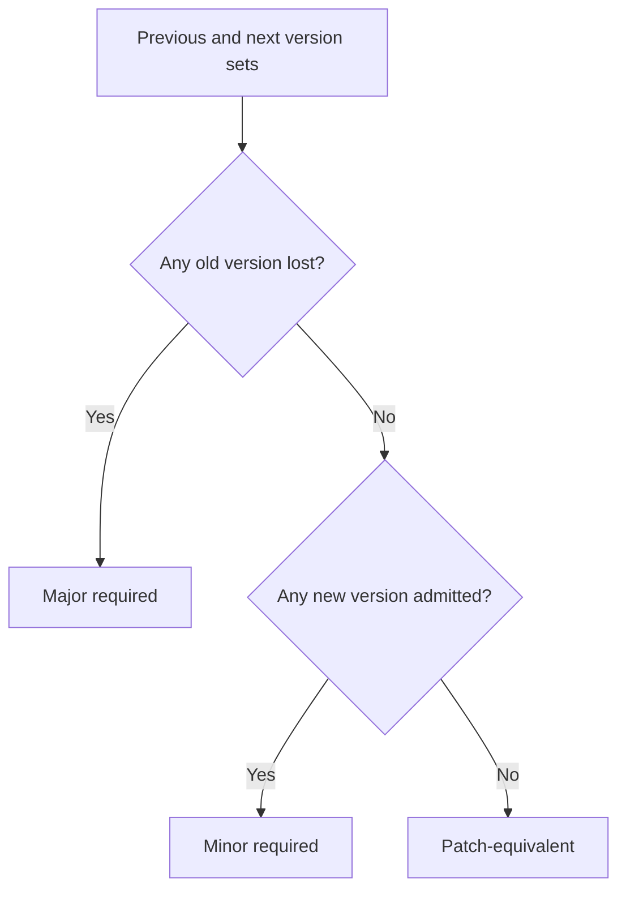
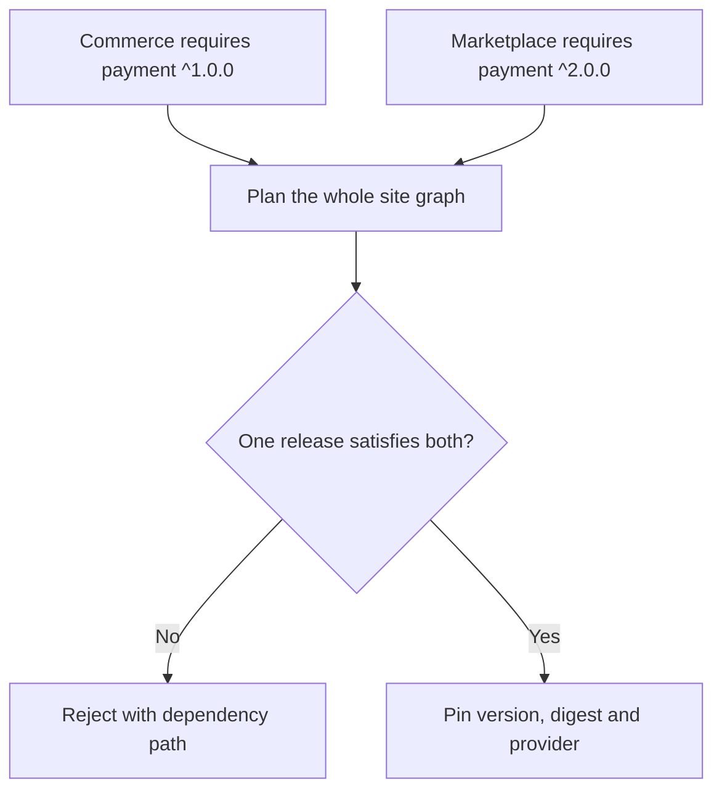

# 3. Capability requirements

[All flows](./README.md) · Next: [Conformance](./04-conformance.md)

## Alternatives, not simultaneous majors — implemented declaration

`versionRange: "^1.0.0 || ^2.0.0"` means either alternative can fulfill the
requirement. It does not mean calling both majors. The version belongs to the
whole contract, not `create-link` separately. Self-contract requirements,
duplicate contract/capability pairs and optional contract requirements reject.

`supportRanges: ["^1.0.0", "^2.0.0"]` explicitly requests evidence for both
major ranges. These one to four nonempty subsets must cover `versionRange`.
Omitting them means a single support range equal to the entire accepted union;
merely spelling it with `||` does not define the evidence matrix.

For each support range, publication needs a historical release jointly
satisfying the source capability's requirements to that dependency contract.
Separate releases exposing separate required capabilities are not enough.
This proves joint reference availability, not whole-site installability.

## Change a dependency range — implemented comparison

Examples for the same existing requirement:

- `^1.0.0` → `>=1.0.0 <2.0.0`: patch-equivalent.
- `^1.0.0` → `^1.0.0 || ^2.0.0`: minor.
- `^1.0.0 || ^2.0.0` → `^2.0.0`: major.

Adding or removing an entire mandatory requirement on an existing capability
is also major. A new capability with its own requirements remains a minor
addition. Prereleases need explicit release-tuple opt-in; `^1.0.0` does not
admit `2.0.0-alpha.1`.

## Availability is a separate question

| Gate | What must resolve? | Yanked releases |
| --- | --- | --- |
| Contract publication: implemented | Each support range, with a joint witness for same-source-capability requirements to the same contract | Valid historical references |
| Provider admission: implemented | At least one release in each requirement's overall range | Excluded; implemented releases also cannot be yanked |
| Conformance: implemented | Exact artifacts and transitive graph for each profile's applicable scenarios; exercised root support-range coverage | No catalogue lifecycle lookup |
| Site selection: implemented | One coherent explicitly selected dependency graph | Every pin in a replacement must be non-yanked; historical stored plans remain readable |

## Conflicting consumers — implemented selection check

In this example the intersection is empty. Serving both majors in one provider
does not fix that site's conflict: V1 plans one selected release per contract
per site. Widen the relevant consumer contract or explicitly migrate it before
changing the selection. The resolver must not silently upgrade other consumers.
The planner checks an explicit proposed selection; it does not search for a
replacement version. Production cutover and dependency-snapshot coordination
remain separate from this pure check and its memory store.

Sources: [parseCapabilityRequirements](../packages/features/cms-repository/src/contracts/core/parsing/parseCapabilityRequirements.ts),
[compareRequirements](../packages/features/cms-repository/src/contracts/core/compatibility/compareRequirements.ts),
[verifyRequirements](../packages/features/cms-repository/src/contracts/core/catalogue/verifyRequirements.ts),
[provider requirement resolution](../packages/features/cms-repository/src/providers/manifests/core/admission/requirements.ts),
[selection planner](../packages/features/cms-repository/src/providers/selections/core/planContractSelections.ts),
[selection policy](../TRANSITION_SOURCES.md).
