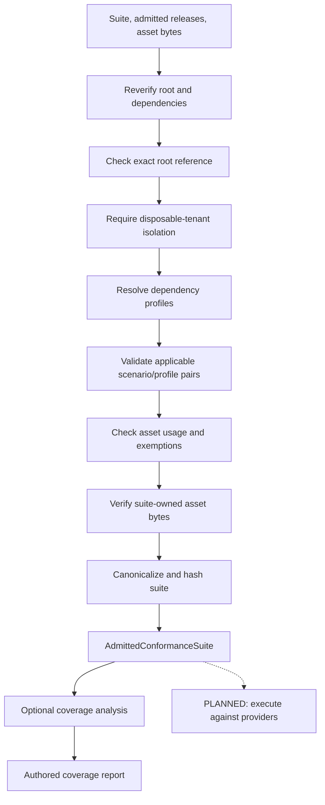
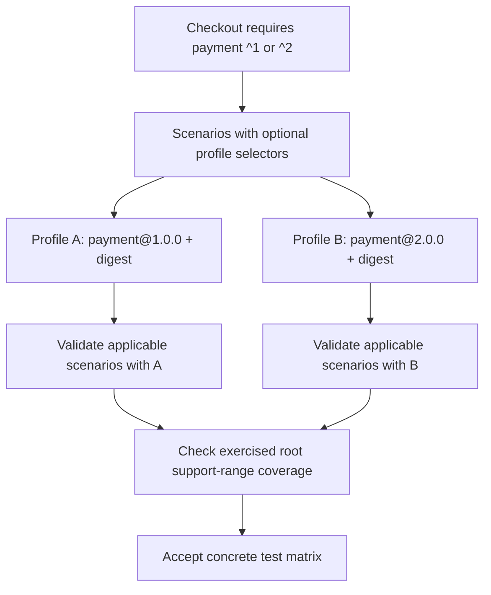
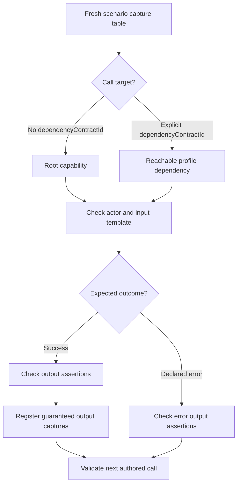
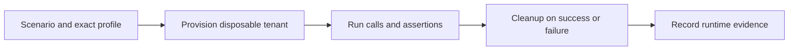

# 4. Conformance

[All flows](./README.md) · Next: [Providers](./05-provider-manifest.md)

## Admit the test artifact — implemented, without execution

Strict document parsing and configured limits apply throughout; failure at any
validation gate rejects. The suite pins the root contract's ID, version and
digest and has its own version and digest. Editing the suite does not change
the release digest. No provider or catalogue is contacted during admission.

`parseConformanceSuite` assumes trusted admitted artifacts and checks the suite
structure. `admitConformanceSuite` also re-verifies artifacts and asset bytes.
Suite assets are explicit: dependency release assets are not automatically
available to scenario inputs.

## Exact dependency profiles — implemented validation

Each profile selects one exact release per dependency contract, including
exercised transitive dependencies. Reject unknown capabilities, unmatched
ranges, conflicting incoming constraints, cycles, duplicate or unused
selections, and unused supplied artifacts. A profile cannot replace the root.

Profiles are required when called root capabilities have requirements. Every
support range of those root requirements needs a matching profile actually
calling that root capability; merely selecting its dependency does not count.
Unexercised root capabilities do not force profiles. Omitted `supportRanges`
means the entire accepted range, not separate evidence per textual OR branch.

Omit a scenario's `profiles` to apply it to all profiles, or select a nonempty
set of known IDs for major-specific scenarios. Every profile needs an applicable
scenario; its graph includes only applicable calls. Each selected pair must be
valid. This does not prove support for every range member, transitive alternative
or Cartesian combination.

## One scenario's calls — implemented validation

External setup/verification calls may use other capabilities of a reachable
dependency; their own requirements must resolve too. Capture references point
only to earlier calls in the same scenario. Captured types must fit the target
schema without projection. Success captures are forbidden on expected errors.

For example: prepare payment data externally → capture an ID → call checkout
on the root using that ID → verify a payment externally. These are authored
test steps, not calls executed during parsing.

Actors are `admin`, `authenticated` or `public`, checked against capability
access. Assertions use `equals` or `present: true`; V1 rejects duplicate and
overlapping ancestor/descendant paths. Captures address whole output, object
properties, bounded array indices or map keys. Presence must be guaranteed by
the schema or established by an exact successful presence/equality check.
`{ $literal: data }` escapes nested template markers without bypassing validation.

Calls can declare `invocationKey`/`replayOf`, bounded operation `completion`,
`eventually` for successful sync queries, or bounded cursor `pagination`.
Pagination checks every page, requires termination, rejects repeated cursors
and optionally enforces unique item identities; it has no captures/aggregation.
These are pure static controls, not executed flows. See
[control semantics](../packages/features/cms-repository/fixtures/contracts/protocol-v1/conformance-controls.md).

## Coverage is not a passing result — implemented

`analyzeConformanceCoverage` describes root successes, assertions, declared
errors, missing coverage and reasoned exemptions, in aggregate and per profile
through `profiles[]`. `successAsserted` means an authored presence/equality
check exists; it does not certify replay correctness or actual success.
External calls never count
as root capability coverage. Incomplete coverage alone does not block suite
admission; invalid, duplicate or redundant exemptions do.

## Execute one scenario/profile pair — planned runner

Repeat with fresh state, identities, key namespace and captures for every
applicable pair. Provisioning,
HTTP execution, cleanup and passing-provider evidence are not implemented in
the contracts domain of `@bernouy/cms-repository`.

Sources: [suite admission](../packages/features/cms-repository/src/contracts/core/admission/admitConformanceSuite.ts),
[suite parsing](../packages/features/cms-repository/src/contracts/core/conformance/parseSuite.ts),
[profile resolution](../packages/features/cms-repository/src/contracts/core/conformance/dependencies/resolveProfiles.ts),
[dependency graph](../packages/features/cms-repository/src/contracts/core/conformance/dependencies/resolveGraph.ts),
[call parsing](../packages/features/cms-repository/src/contracts/core/conformance/calls/parseCall.ts),
[coverage](../packages/features/cms-repository/src/contracts/core/conformance/coverage.ts).
