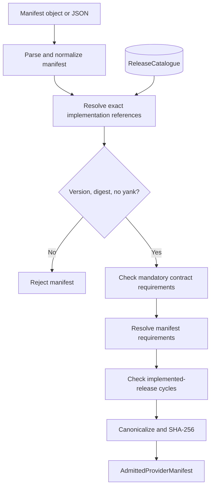
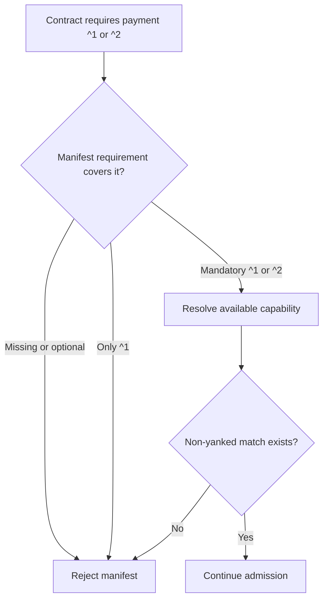
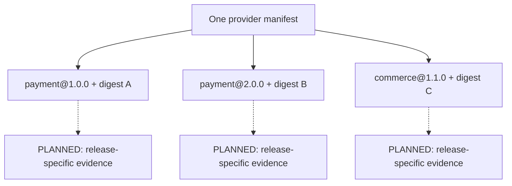

# 5. Provider manifests

[All flows](./README.md) · Next: [Runtime and upgrades](./06-runtime-upgrades.md)

## Admission — implemented

Each gate can reject. Structure checks include unknown fields, duplicates,
configured limits, configuration schemas, endpoint policies and credential
slot declarations. Allowed origins are not a site's selected endpoint, and
credential slots contain no installation secret values.

The result is an admitted artifact, not a persisted manifest publication or
an installed provider. A separate `InMemoryProviderManifestCatalogue.publish`
reverifies the artifact and accepts immutable versions with stable publisher
ownership. It supports exact lookup and reversible yank metadata; production
durable storage remains an adapter responsibility.

`compareProviderManifests` describes changes for an approval screen without
claiming SemVer compatibility. A new digest requires explicit installation
approval, which never upgrades a site's contract selections on its own.

## Do not narrow the contract promise — implemented

The actual rule is set inclusion: every version admitted by each capability's
contract requirement must be admitted by the corresponding non-optional
manifest requirement. Equivalent range spellings are accepted. A provider may
also declare implementation-specific requirements.

Every manifest requirement, even an optional one, must resolve to at least one
non-yanked release in its overall range exposing the capability. This is not
the contract catalogue's historical joint-witness check per `supportRanges`
entry. `versionRange` defines the contract's promise; evidence partitions do not
authorize a provider to narrow that accepted set.

## Several exact releases in one build — supported declaration

Claims are unique by `(contractId, version)` and sorted independently of locale.
Every digest is verified separately. Claiming `payment@1.4.5` does not implicitly
claim `payment@1.0.0`: sharing code is allowed, but serving the old contract still
needs its explicit claim and release-specific conformance evidence.

Cycle detection uses exact implemented releases as nodes. A requirement edge
only reaches a release if both its range and required capability match.
Optional requirements also participate in this conservative cycle check.
Passing it does not establish global site-selection satisfiability.

Sources: [admission](../packages/features/cms-repository/src/providers/manifests/core/admission/admitProviderManifest.ts),
[reference validation](../packages/features/cms-repository/src/providers/manifests/core/admission/validateProviderManifest.ts),
[requirements](../packages/features/cms-repository/src/providers/manifests/core/admission/requirements.ts),
[implementation graph](../packages/features/cms-repository/src/providers/manifests/core/admission/implementationGraph.ts),
[implementation parsing](../packages/features/cms-repository/src/providers/manifests/core/parsing/parseImplementations.ts).

See [provider workflows](../packages/features/cms-repository/src/providers/workflows.md)
for publication, approval, selection and observation sequencing.
