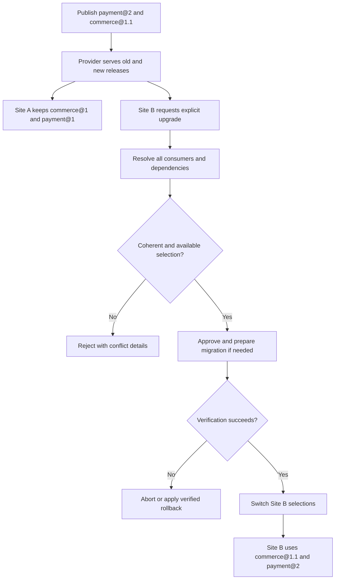
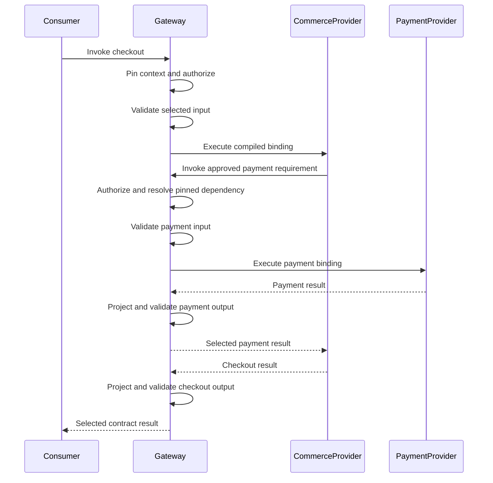
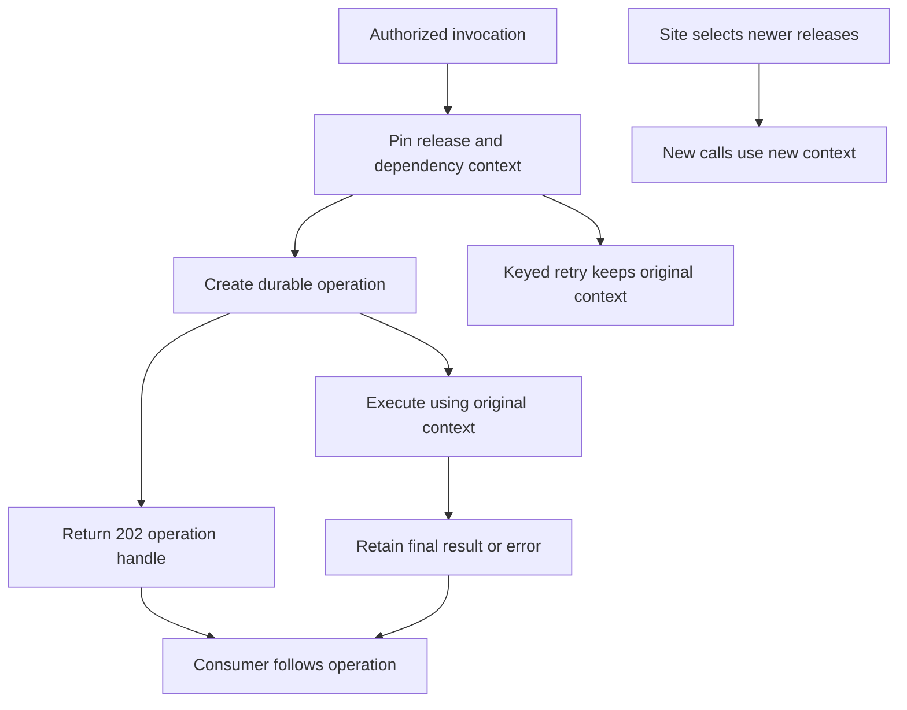

# 6. Runtime and site upgrades

[All flows](./README.md)

Every diagram on this page is **planned behavior**. `@bernouy/cms-repository`
already provides contract parsers, compiled bindings, the catalogue, schema
projection, provider manifest admission and pure installation, connection and
runtime-report models and validators. Local installation lifecycle, manifest
publication/comparison, selection graph planning and memory stores also exist.
Live connections, production orchestration and gateway execution remain future
runtime work. Concrete routes and version-negotiation headers are not defined
by these diagrams.

## A provider deployment is not a site upgrade — planned

Example: commerce's public API stays compatible while its payment requirement
expands from `^1.0.0` to `^1.0.0 || ^2.0.0` in `commerce@1.1.0`.

Version labels are shorthand here: stored selections must pin exact versions
and digests plus the selected provider context. The provider must explicitly
claim each served release and obtain conformance evidence for it. V1 chooses
one release per contract per site; it must reject conflicts rather than
silently upgrading other consumers. Rollback is a domain-specific plan, not
an assumption that changing a version pointer reverses a data migration.

Later, `commerce@2` may drop the payment v1 alternative. That is a major change
and an explicit site upgrade. The catalogue can still accept maintenance
releases on commerce's stable v1 major line.

## A synchronous call using a dependency — planned

This is a successful authorized call; rejection stops before the next step.
Provider-to-gateway calls use approved installation authority, not implicit
delegation of the initiating user's permissions.

Requirements come from the approved manifest, never a provider's runtime
report. Supporting two dependency majors may require two adapters inside the
provider. A range declaration does not translate input/output automatically.

## Long-running operations and retries — planned

The HTTP binding compiler already distinguishes an operation's JSON `202`
handle from its declared final output. Persistence, polling, workers and replay
are future runtime work. Operation and keyed-retry contexts must preserve
release, dependency selections and provider context across an upgrade.

An error's `retryable` flag alone does not authorize replay of a non-idempotent
command. Provider support for old selections must remain during the required
overlap; `sunsetAt` cannot silently cut off installed sites or in-flight work.

Sources: [versioning and selection policy](../TRANSITION_SOURCES.md),
[installation, invocation and durability plan](../PLAN_ACTION.md),
[current operation binding checks](../packages/features/cms-repository/src/contracts/core/bindings/response.ts),
[capability behavior](../packages/features/cms-repository/src/contracts/interfaces/ContractRelease.ts).
