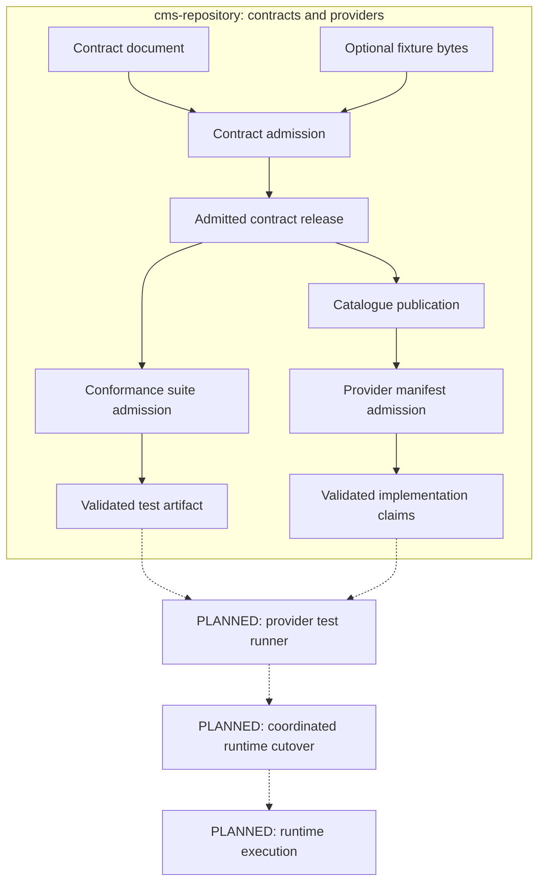

# Repository contracts and providers: flow diagrams

These diagrams describe the contracts and providers domains of
`@bernouy/cms-repository`. Read the numbered files in order, or follow the
question that interests you. A collections domain belongs in the same package
but remains planned, with no implementation or export yet.

## Reading guide

1. [Contract admission and publication](./01-contract-release.md): how a
   document, mocks and assets become an immutable catalogue release.
2. [Compatibility and versioning](./02-compatibility.md): patch/minor/major,
   output projection, report flags and prerelease maintenance.
3. [Capability requirements](./03-requirements.md): version alternatives,
   historical references and implemented full-site selection checks.
4. [Conformance](./04-conformance.md): exact dependency profiles, ordered calls,
   captures, coverage and the future execution boundary.
5. [Provider manifests](./05-provider-manifest.md): exact implementation claims,
   mandatory requirements and multi-release support.
6. [Runtime and site upgrades](./06-runtime-upgrades.md): planned invocation,
   independent site upgrades, operations and retry context.

Open the files in a Markdown viewer with Mermaid support. The fenced blocks
are the editable diagram sources; no network service or generated image is
needed to maintain them.

## Overview

## How to read the diagrams

- **Implemented** means executable code exists in the contracts or providers
  domain of `@bernouy/cms-repository`, not that the whole product is deployed.
- **Planned** means an architectural requirement documented in the transition
  plan. It is not a callable API of this package.
- Solid arrows show normal flow. Dashed arrows in the overview cross into
  planned work. Each detailed diagram states its own implementation status.
- Diamonds are decisions; failure branches stop the described operation.
- Names such as `payment`, `commerce` and `emailer` are illustrative domains,
  not claims that official domain contracts have already been ported.

Admission, publication, provider conformance and site installation are four
different gates. A digest is an immutable identity, not evidence that a running
provider passed tests. No diagram introduces an implicit version-negotiation
header or automatic site upgrade.

Local manifest publication, approval, explicit selection planning and memory
storage now exist independently of that future runner/cutover orchestration.
See [provider workflows](../packages/features/cms-repository/src/providers/workflows.md)
for their exact implemented boundaries.

## Source of truth

- [Repository package guide](../packages/features/cms-repository/README.md)
- [Repository package rules](../packages/features/cms-repository/AGENTS.md)
- [Contracts domain guide](../packages/features/cms-repository/src/contracts/README.md)
- [Providers domain guide](../packages/features/cms-repository/src/providers/README.md)
- [Transition design](../TRANSITION_SOURCES.md)
- [Implementation plan](../PLAN_ACTION.md)
